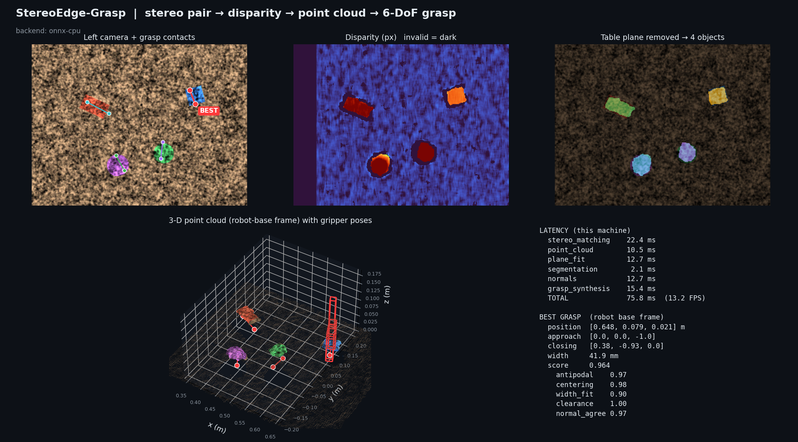

# StereoEdge-Grasp
**Real-time 3-D grasp synthesis from low-cost stereo vision, designed for on-device inference on the Snapdragon NPU.**

Two ordinary cameras → neural stereo matching (ONNX, QNN-ready) → 3-D point cloud → collision-checked, antipodal
6-DoF grasp for a parallel-jaw gripper. No RGB-D sensor, no cloud round-trip: frames never leave the device.



## Quick start (any machine, ~1 minute)
```bash
pip install -r requirements.txt
python tools/export_onnx.py            # (re)builds models/stereo_costvolume.onnx
python demo.py                         # SGBM baseline on a built-in synthetic scene
python demo.py --backend onnx-cpu --gif
python -m pytest -q tests              # 7 tests
python benchmarks/latency.py           # per-stage latency table -> outputs/benchmark.md
```
Outputs land in `outputs/`: `overview.png`, `grasp_3d.png`, `stereo_pair.png`, `grasps.json`, `grasp_sequence.gif`.

## Running on a Snapdragon X PC (HP / Windows on ARM64)
```powershell
powershell -ExecutionPolicy Bypass -File scripts\setup_snapdragon.ps1
python demo.py --backend onnx-qnn         # stereo network on the Hexagon NPU (QNN HTP backend)
python benchmarks\latency.py --iters 50   # measured NPU numbers appear in the onnx-qnn column
```
Requirements: **native ARM64 Python** (an x64 Python under emulation cannot load the QNN provider) and
`onnxruntime-qnn`. If the QNN Execution Provider is missing, `--backend onnx-qnn` warns and falls back to CPU;
the benchmark reports the NPU column as `n/a` rather than estimating it. Details: `docs/snapdragon_deployment.md`.

## Pipeline
| Stage | Module | Runs on |
|---|---|---|
| Rectification (real cameras) | `stereo/rectify.py` | CPU (OpenCV) |
| **Stereo matching** | `inference/backend.py`, `inference/onnx_model.py` | **NPU via QNN EP** / CPU / SGBM baseline |
| Disparity → point cloud, RANSAC table plane, object segmentation, PCA normals | `pointcloud/reconstruct.py` | CPU (NumPy/SciPy) |
| Antipodal grasp synthesis + scoring + finger-volume collision check | `grasp/antipodal.py` | CPU |
| Simulation | `viz.py` (kinematic GIF), `sim/pybullet_arm.py` (optional) | CPU |

**Grasp model.** Objects are segmented above the RANSAC table plane. Contact candidates are contour points of each
object's footprint in metric table coordinates; a pair is antipodal if each contact's inward normal lies within the friction
cone (25°) of the line joining them and the span fits the gripper (12–80 mm). Candidates are scored on antipodal quality,
centering on the object, width fit, clearance around the fingers, and agreement with 3-D PCA surface normals, then
rejected if the two finger volumes (or the table) intersect any scene point. Output: position, rotation (closing axis,
lateral axis, approach vector), gripper width, score — in camera and robot-base frames (`grasps.json`).

**Backends.** `sgbm` (OpenCV, classical baseline), `onnx-cpu`, `onnx-qnn`, `auto`. The bundled ONNX graph is a
fixed-weight SAD cost-volume network built only from NPU-friendly tensor ops (Pad, Slice, Sub, Abs, Concat, AveragePool,
ArgMin). It is the drop-in slot for a *trained* stereo network with the same I/O contract (`left`,`right` → `cost`,`disparity`),
e.g. a lightweight HITNet / RAFT-Stereo variant exported to ONNX, or a depth model from Qualcomm AI Hub.

## Real cameras
```bash
python demo.py --left L.png --right R.png --calib calib.npz --handeye T_base_cam.npy
```
`calib.npz` = `K1,D1,K2,D2,R,T,size` from `cv2.stereoCalibrate`; `T_base_cam.npy` is your 4×4 hand-eye transform.

## What has and has not been verified
Verified in development (Linux x86-64, 1 CPU core, Python 3.12): all 7 tests; both CPU backends; grasps land within 2 cm
of ground-truth object centres with widths within the gripper limits; the numbers in `outputs/benchmark.md`.

**Not verified here (needs hardware/accounts):** execution on the Hexagon NPU (`onnx-qnn`), `tools/aihub_profile.py`,
the PyBullet Panda run (`sim/pybullet_arm.py`), the Open3D viewer, and any real-camera dataset. No NPU speed-up or power figure is claimed;
measure with `benchmarks/latency.py` on the device and with AI Hub profiling.

## Limitations
* Stereo needs texture; glossy / transparent / featureless surfaces degrade disparity. Add an active pattern or a trained model.
* The synthetic demo scene is clean and top-down; real clutter, lighting and stacked objects are harder.
* Contour-based antipodal search assumes a roughly top-down view and vertical-walled objects; a learned grasp scorer is future work.
* Only grasp *synthesis* is validated; closed-loop execution on a physical arm is future work.

## Layout
```
demo.py  src/stereoedge/{config,synth,pipeline,viz,viz_o3d}.py
src/stereoedge/{inference,stereo,pointcloud,grasp,sim}/   tools/  benchmarks/  tests/  docs/  outputs/  scripts/
```
MIT licensed.
